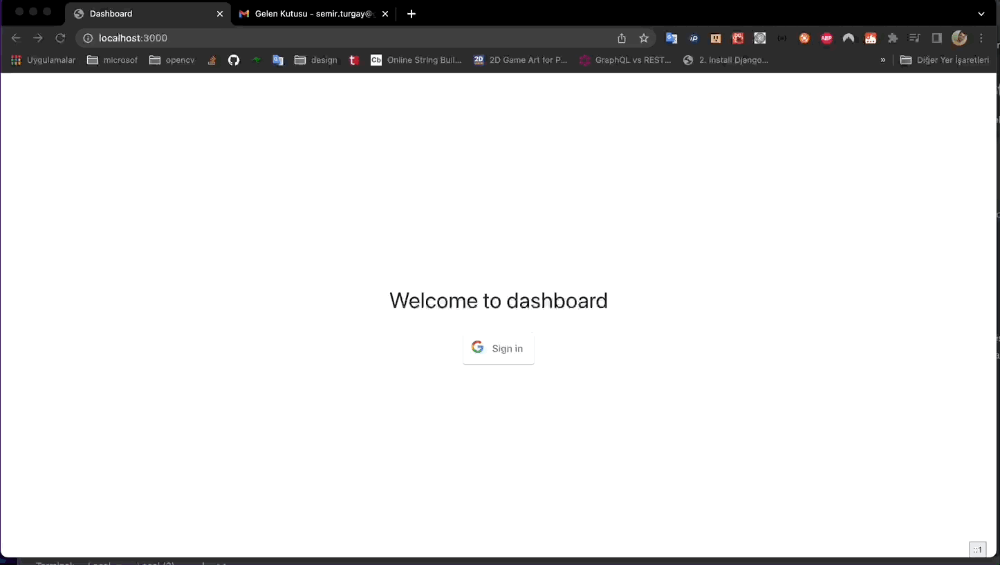

This is a [Next.js](https://nextjs.org/) project bootstrapped with [`create-next-app`](https://github.com/vercel/next.js/tree/canary/packages/create-next-app).

## Getting Started

First, install dependencies by running:
```bash
yarn
```
then run:
```bash
npm run dev
# or
yarn dev
```

Open [http://localhost:3000](http://localhost:3000)

## Demo


## Todos

- [ ] add more tests
- [ ] move the pagination to the server side
